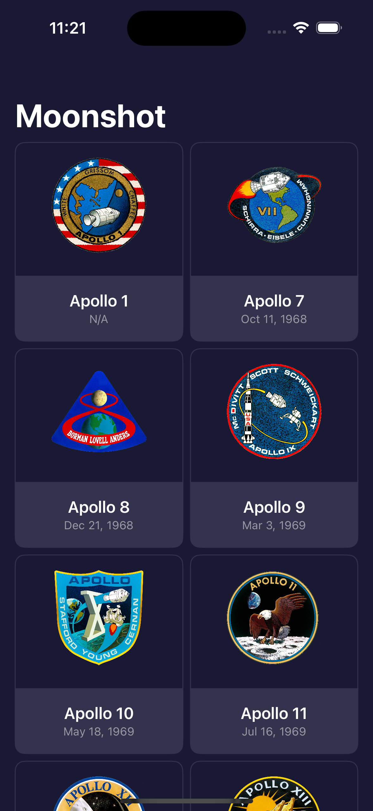
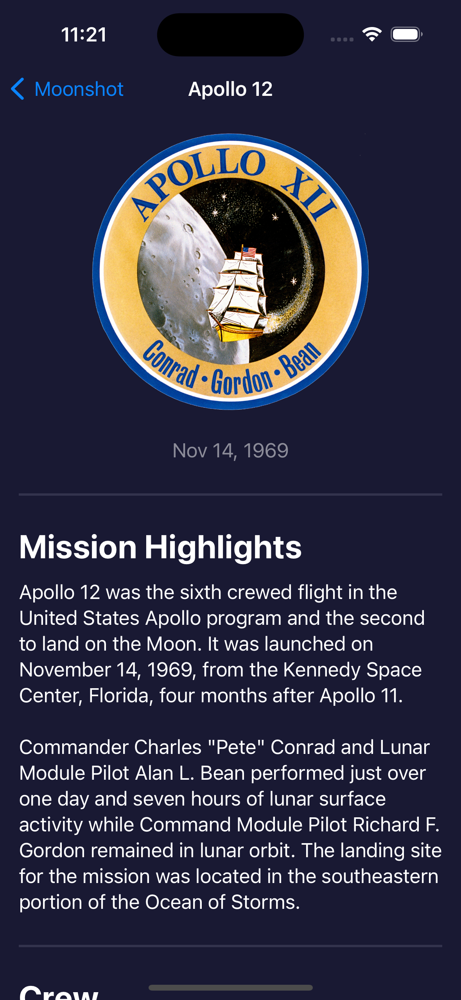
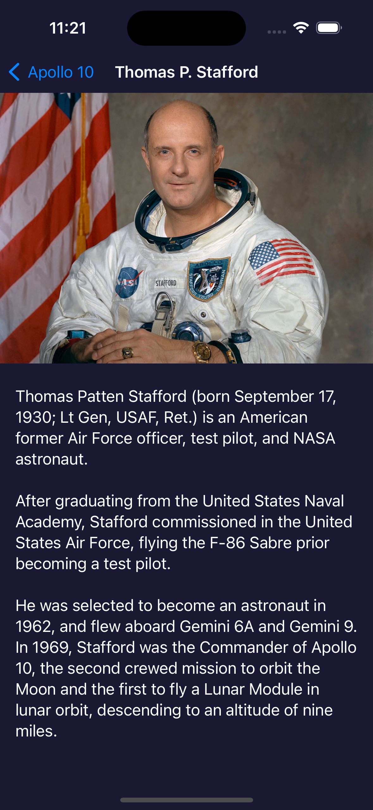

# Moonshot

Moonshot is an immersive iOS app developed using SwiftUI, inspired by NASA's Apollo space program. This app offers a deep dive into the Apollo missions, providing users with detailed information about the astronauts and their space journeys.

    
    
    

## How to Play

1. Launch the app to view a grid of Apollo missions.
2. Tap on a mission to learn more about its objectives, crew, and historical context.
3. Explore the astronaut profiles to understand their roles in the missions and their contributions to space exploration.

## Technologies Used

- **SwiftUI**: Utilized for crafting the user interface, providing an interactive and educational experience.
- **Swift**: The programming language used to implement the app's functionality and data handling.
- **Xcode**: The IDE where the app was developed, leveraging SwiftUI's powerful features to create an informative and engaging application.

## Getting Started

To run this project locally, you'll need:

- Make sure Xcode is installed on your Mac.
- Clone this repository to access the project.
- Open the project in Xcode.
- Build and run the app on your preferred simulator or iOS device.

## Credits

This project is part of the ["100 Days of SwiftUI"](https://www.hackingwithswift.com/100/swiftui) course by Paul Hudson. I learned how to build this project and further develop my SwiftUI skills through the course.

## Learning Experience

In addition to following the main project instructions, I completed extra challenges provided at the end of the course where there were no instructions.
